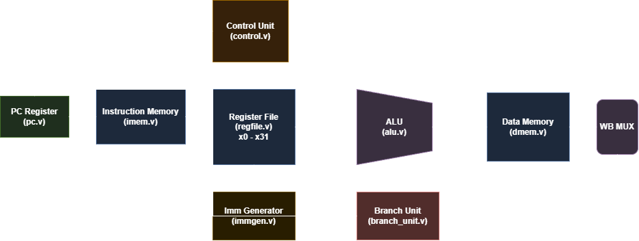
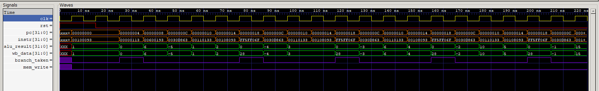
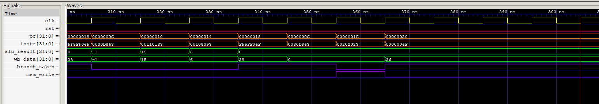

# RV32I Non-Pipelined RISC-V Core

A single-cycle, non-pipelined 32-bit RISC-V processor core designed from scratch in Verilog HDL.

The processor implements the complete datapath and control logic required to fetch, decode, execute, access memory, and write back results for the base integer RV32I instruction set.

---

## Architecture Overview

---

## Supported Instructions

### R-Type ALU
* `ADD`
* `SUB`
* `AND`
* `OR`
* `XOR`
* `SLL`
* `SRL`
* `SRA`
* `SLT`
* `SLTU`

### I-Type ALU
* `ADDI`
* `ANDI`
* `ORI`
* `XORI`
* `SLTI`
* `SLTIU`
* `SLLI`
* `SRLI`
* `SRAI`

### Load
* `LW`
* `LH`
* `LB`
* `LHU`
* `LBU`

### Store
* `SW`
* `SH`
* `SB`

### Branch
* `BEQ`
* `BNE`
* `BLT`
* `BGE`
* `BLTU`
* `BGEU`

### Jump & Upper Immediate
* `JAL`
* `JALR`
* `LUI`
* `AUIPC`

---

## Project Structure

    RV32I-non-pipelined-RISC-V-core/
    │
    ├── RTL/
    │   ├── RISCVCORE.v
    │   ├── alu.v
    │   ├── branch_unit.v
    │   ├── control.v
    │   ├── dmem.v
    │   ├── imem.v
    │   ├── immgen.v
    │   ├── instfetch.v
    │   ├── pc.v
    │   ├── program.hex
    │   └── regfile.v
    │
    ├── TB/
    │   ├── TheTestbench.v
    │   ├── alutb.v
    │   ├── controltb.v
    │   ├── ifetchtb.v
    │   ├── pctb.v
    │   └── regfiletb.v
    │
    └── Images/
        ├── Datapath.png
        ├── waveform_loop.png
        └── waveform_store.png

---

## Verification

The core was verified using Icarus Verilog and GTKWave. The test program (`program.hex`) executes an iterative loop computing the summation of integers from 1 to 5 ($\sum_{i=1}^{5} i = 15$) and stores the final result into data memory address 0:

    addi x1, x0, 1       # x1 (i) = 1
    addi x2, x0, 0       # x2 (sum) = 0
    addi x3, x0, 6       # x3 (limit) = 6
    loop:
    bge  x1, x3, done    # if i >= 6, branch to done (+16 bytes)
    add  x2, x2, x1      # sum += i
    addi x1, x1, 1       # i++
    jal  x0, loop        # jump back to loop (-12 bytes)
    done:
    sw   x2, 0(x0)       # store final sum (15) to mem[0]
    jal  x0, done        # halt

The system testbench (`TheTestbench.v`) verifies the final word written to data memory location `0x0`:

    PASS: sum(1..5) = 15 stored at mem[0]
    --- Register File Snapshot ---
      x0 = 0
      x1 = 6
      x2 = 15
      x3 = 6
      x4 = 0
      x5 = 0
      x6 = 0
      x7 = 0

### Waveforms

#### 1. Loop Execution & Register Accumulation
Execution trace showing register file updates (`wb_data`), PC loop transitions, and branch evaluations:

#### 2. Data Memory Store
Cycle snapshot showing `sw x2, 0(x0)` asserting `mem_write` high and latching the sum value `15` into address `0x0`:

---

## Simulation

From the repository root:

    cd RTL
    iverilog -g2012 -o sim.out ..\TB\TheTestbench.v RISCVCORE.v instfetch.v pc.v imem.v regfile.v immgen.v alu.v dmem.v branch_unit.v control.v
    vvp sim.out

To view the generated simulation waveform in GTKWave:

    gtkwave tb_riscv_core.vcd
