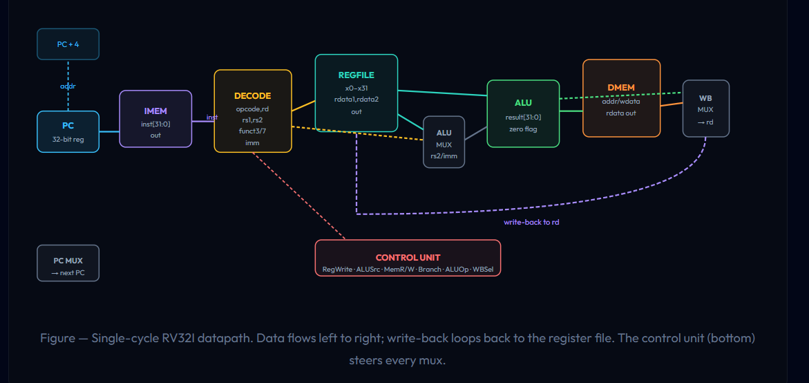

# RV32I Non-Pipelined RISC-V Core

A **single-cycle, non-pipelined RISC-V processor** implemented in **Verilog HDL**.

The processor implements the datapath and control logic required to fetch, decode, execute, access memory, and write back results for a subset of the **RV32I instruction set**.

## Architecture

The processor consists of the following major blocks:


                 ┌───────────────┐
                 │ Program       │
                 │ Counter       │
                 └───────┬───────┘
                         │
                         ▼
                 ┌───────────────┐
                 │ Instruction   │
                 │ Memory        │
                 └───────┬───────┘
                         │
                         ▼
                 ┌───────────────┐
                 │ Instruction   │
                 │ Decode        │
                 └───────┬───────┘
                         │
          ┌──────────────┼──────────────┐
          ▼              ▼              ▼
     ┌─────────┐   ┌──────────┐   ┌──────────┐
     │ RegFile │   │ Imm Gen  │   │ Control  │
     └────┬────┘   └────┬─────┘   └──────────┘
          │             │
          └──────┬──────┘
                 ▼
            ┌─────────┐
            │   ALU   │
            └────┬────┘
                 │
          ┌──────┴──────┐
          ▼             ▼
     ┌─────────┐   ┌──────────┐
     │ Data    │   │ Writeback│
     │ Memory  │   │   MUX    │
     └─────────┘   └────┬─────┘
                         │
                         ▼
                    Register File


## Supported Instructions

### R-Type ALU

* `ADD`
* `SUB`
* `AND`
* `OR`
* `XOR`
* `SLL`
* `SRL`
* `SRA`
* `SLT`
* `SLTU`

### I-Type ALU

* `ADDI`
* `ANDI`
* `ORI`
* `XORI`
* `SLTI`
* `SLTIU`
* `SLLI`
* `SRLI`
* `SRAI`

### Load

* `LW`
* `LH`
* `LB`
* `LHU`
* `LBU`

### Store

* `SW`
* `SH`
* `SB`

## Project Structure

```text
RV32I-non-pipelined-RISC-V-core/
│
├── RTL/
│   ├── RILS_core.v
│   ├── ALU
│   ├── Control Unit
│   ├── Register File
│   ├── Immediate Generator
│   ├── Instruction Memory
│   ├── Data Memory
│   └── Instruction Fetch
│
├── Testbenches/
│   └── tb_core_rils.v
│
├── VCD/
│   ├── tb_core_rils.vcd
│   ├── tb_core_rils.gtkw
│   └── waveform.pdf
│
└── program1.hex
```

## Verification

The processor is simulated using **Icarus Verilog** and waveforms are inspected using **GTKWave**.

One of the current verification programs tests the following sequence:

```asm
addi x1, x0, 42
sw   x1, 0(x0)
lw   x2, 0(x0)
nop
```

Expected result:

```text
x1 = 42
Memory[0] = 42
x2 = 42
```

The testbench checks the final value of `x2` and reports:

```text
PASS: x2 = 42 (expected 42)
```

### Waveform

The GTKWave output demonstrates the instruction execution and datapath operation, including:

* Program counter progression
* Instruction decoding
* ALU operation
* Register operands
* Memory address calculation
* Memory read/write
* Write-back data

See the waveform output in the `VCD/` directory.

## Simulation

From the repository root:

```powershell
iverilog -o sim.vvp RTL/*.v Testbenches/tb_core_rils.v
vvp sim.vvp
```

The simulation generates a VCD waveform that can be opened with GTKWave:

```powershell
gtkwave VCD/tb_core_rils.vcd
```

## Tools

* **Verilog HDL**
* **Icarus Verilog**
* **GTKWave**
* **VS Code**

## Current Status

* [x] Instruction fetch
* [x] Program counter
* [x] Instruction decoding
* [x] Register file
* [x] Immediate generation
* [x] ALU
* [x] Control unit
* [x] Load/store datapath
* [x] Write-back MUX
* [x] Basic simulation and verification

## Future Work

* Add branch instructions
* Add `JAL` / `JALR`
* Expand RV32I instruction coverage
* Improve automated verification
* Synthesize the RTL and analyze area/timing
* FPGA implementation
